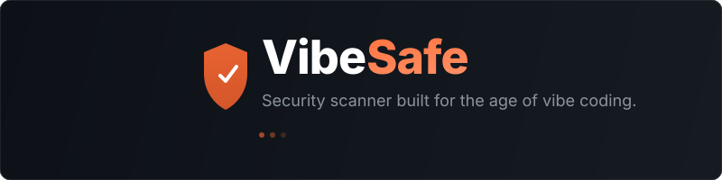

<p align="center">
  
</p>

<p align="center">
  <a href="https://github.com/shaangurushankar/VibeSafe/actions/workflows/ci.yml"></a>
  <a href="https://www.npmjs.com/package/vibesafe"></a>
  <a href="https://github.com/shaangurushankar/VibeSafe/blob/main/LICENSE"></a>
  <a href="https://nodejs.org">= 18"></a>
</p>

---

AI writes your code in seconds. VibeSafe tells you if it's safe to ship.

One command scans your entire project for hardcoded secrets, vulnerable dependencies, and common security anti-patterns — then gives you a **Safety Score** from 0 to 100. No config files. No cloud accounts. Just run it.

```bash
npx vibesafe scan .
```

## Demo

```
 ██╗   ██╗██╗██████╗ ███████╗███████╗ █████╗ ███████╗███████╗
 ██║   ██║██║██╔══██╗██╔════╝██╔════╝██╔══██╗██╔════╝██╔════╝
 ██║   ██║██║██████╔╝█████╗  ███████╗███████║█████╗  █████╗
 ╚██╗ ██╔╝██║██╔══██╗██╔══╝  ╚════██║██╔══██║██╔══╝  ██╔══╝
  ╚████╔╝ ██║██████╔╝███████╗███████║██║  ██║██║     ███████╗
   ╚═══╝  ╚═╝╚═════╝ ╚══════╝╚══════╝╚═╝  ╚═╝╚═╝     ╚══════╝

 ✔ Detecting project type... nodejs, python
 ✔ Running SAST scan... 4 issues found
 ✔ Scanning for secrets... 2 issues found
 ✔ Dependency scan complete — 1 issue found

 🔴 CRITICAL  AWS Secret Access Key
    src/config/db.ts:14
    An AWS Secret Access Key is hardcoded in your source code.
    Move it to an environment variable immediately.

 🟠 HIGH  SQL Injection
    src/routes/users.ts:42
    User input is concatenated directly into a SQL query.
    Use parameterized queries instead.

 📊 SCAN COMPLETE
    ├── 🔴 Critical:   1
    ├── 🟠 High:       3
    └── 🟡 Medium:     3

    ╭─────────────────────────────╮
    │   VibeSafe Score: 32 / 100  │
    │   Grade: F                  │
    │   ⛔ FIX BEFORE SHIPPING    │
    ╰─────────────────────────────╯
```

## Why VibeSafe?

Cursor, Copilot, Bolt, v0, and Lovable are incredible tools. But they generate code that regularly includes hardcoded API keys, `eval()` calls, SQL injection vulnerabilities, and dependencies with known CVEs. You don't always notice. VibeSafe does.

**This is not a general-purpose SAST tool.** It's purpose-built for the specific failure modes of AI-generated code:

- Secrets that the LLM hallucinated or copied from training data
- `Math.random()` used for tokens instead of `crypto`
- Express routes with zero auth middleware
- Dependencies the AI picked because they were popular in 2021

## Quick Start

### Global / CI Usage
```bash
# Scan any project (no install required)
npx vibesafe scan .

# Or install globally
npm install -g vibesafe
vibesafe scan ./my-project

# JSON output for CI pipelines
vibesafe scan . --json
```

### Running Locally from Source
If you are developing VibeSafe or want to run it directly from this source code:
```bash
# 1. Install dependencies and build the TypeScript project
pnpm install
pnpm build

# 2. Run the CLI directly using Node (relative or absolute path to target project)
node packages/cli/dist/index.js scan /path/to/your/project

# 3. Or link it globally so you can use the 'vibesafe' command anywhere
cd packages/cli && npm link
# Now you can cd into any other directory (e.g., 'kairo') and run:
vibesafe scan .
```

VibeSafe auto-detects your project type and runs the appropriate scanners. No configuration needed.

## What It Finds

### Secrets — 14 Detection Rules

VibeSafe scans every file in your repo for hardcoded credentials.

| Rule | What it catches | Severity |
|------|----------------|----------|
| AWS Access Key | `AKIA...` patterns | Critical |
| AWS Secret Key | AWS secret access keys | Critical |
| GitHub PAT | `ghp_` and `github_pat_` tokens | Critical |
| Stripe Live Key | `sk_live_` API keys | Critical |
| Private Keys | RSA, EC, DSA, OpenSSH private keys | Critical |
| OpenAI Key | `sk-` API keys | Critical |
| Supabase JWT | Service-role JWTs | Critical |
| Google API Key | `AIza...` patterns | High |
| Slack Webhook | `hooks.slack.com/services/` URLs | High |
| Generic Password | Hardcoded `password = "..."` assignments | High |
| Generic API Key | Hardcoded `api_key = "..."` assignments | High |
| Generic Secret | Hardcoded `secret = "..."` assignments | High |
| Stripe Test Key | `sk_test_` keys (lower risk) | Low |
| Entropy Detection | Any high-entropy string (Shannon ≥ 4.5) | High |

Smart filtering: skips comments, placeholder values (`your_api_key_here`), test fixtures with obvious dummy data, and binary files.

### SAST — 8 Built-in Rules

Static analysis for the patterns AI loves to generate.

| Rule | What it catches | Severity | OWASP |
|------|----------------|----------|-------|
| SQL Injection | String concatenation in queries | High | A03:2021 |
| XSS | `innerHTML` / `dangerouslySetInnerHTML` | High | A03:2021 |
| Command Injection | `exec()` / `spawn()` with variables | High | A03:2021 |
| Dangerous eval | `eval()` with dynamic input | High | A03:2021 |
| Hardcoded JWT | Inline secrets in `jwt.sign()` | Critical | A02:2021 |
| No Auth Middleware | Express routes without auth | Medium | A07:2021 |
| Insecure Random | `Math.random()` for security contexts | Medium | A02:2021 |
| Python SQL Injection | f-strings / %-formatting in `execute()` | High | A03:2021 |

**Have Semgrep installed?** VibeSafe automatically uses it for deeper analysis alongside these rules. Don't have it? The built-in rules still catch the most critical patterns.

### Dependencies — npm audit + Known Bad Packages

| Check | What it does |
|-------|-------------|
| `npm audit` | Parses audit output for known CVEs in your dependency tree |
| `pip-audit` | Same for Python projects (when available) |
| Known-bad packages | Flags 10 historically compromised npm packages (`event-stream`, `ua-parser-js`, `node-ipc`, etc.) |

Each finding includes the package name, installed version, fixed version, and CVE identifier.

## Safety Score

Every scan produces a score from **0 to 100**.

```
Score = 100 - Σ(severity_weight × category_multiplier)
```

| Severity | Weight | | Category | Multiplier |
|----------|--------|-|----------|------------|
| Critical | 25 | | Secrets | 1.5× |
| High | 10 | | SAST | 1.0× |
| Medium | 4 | | Dependencies | 0.8× |
| Low | 1 | | Config | 0.6× |
| Info | 0 | | | |

Secrets are weighted highest because a leaked API key in a public repo is an immediate incident, not a theoretical risk.

| Grade | Score | Verdict |
|-------|-------|---------|
| **A** | 90–100 | ✅ Safe to ship |
| **B** | 75–89 | ✅ Safe to ship |
| **C** | 60–74 | ⚠️ Review before shipping |
| **D** | 40–59 | ⚠️ Review before shipping |
| **F** | 0–39 | ⛔ Fix before shipping |

## Configuration

### `.vibesafeignore`

Works like `.gitignore`. Drop it in your project root to exclude files or directories from scanning.

```gitignore
# Skip test fixtures
__tests__/fixtures/
test/mock-data/

# Skip generated code
generated/
*.generated.ts

# Skip vendored dependencies
vendor/
```

### Built-in Ignores

These are always excluded — no configuration needed:

- `node_modules/`, `.git/`, `dist/`, `build/`, `.next/`, `__pycache__/`
- Lock files (`package-lock.json`, `pnpm-lock.yaml`, `yarn.lock`)
- Binary files (images, fonts, archives)
- Files over 1 MB

## CI/CD Integration

### Exit Codes

| Code | Meaning |
|------|---------|
| `0` | No critical or high severity findings |
| `1` | Critical or high severity findings detected |
| `2` | Scanner error |

### GitHub Actions

```yaml
name: Security Scan

on: [push, pull_request]

jobs:
  vibesafe:
    runs-on: ubuntu-latest
    steps:
      - uses: actions/checkout@v4

      - name: Setup Node.js
        uses: actions/setup-node@v4
        with:
          node-version: 20

      - name: Run VibeSafe
        run: npx vibesafe scan . --json
```

### JSON Output

```bash
vibesafe scan . --json
```

Returns a structured JSON object with `findings`, `summary`, `score`, and `meta` fields — ready for parsing in any CI pipeline.

## Supported Project Types

| Language | Detection | Dependency Scanning |
|----------|-----------|-------------------|
| Node.js | `package.json` | ✅ npm audit + known-bad packages |
| Python | `requirements.txt`, `pyproject.toml`, `Pipfile`, `setup.py` | ✅ pip-audit (when installed) |
| Rust | `Cargo.toml` | Planned |
| Go | `go.mod` | Planned |

Multiple project types are detected simultaneously — monorepos with both Node.js and Python are scanned with the appropriate tools for each.

## Roadmap

- [x] Secrets scanner (14 rules + entropy detection)
- [x] SAST scanner (8 built-in rules + Semgrep integration)
- [x] Dependency scanner (npm audit, pip-audit, known-bad packages)
- [x] Safety Score with A–F grading
- [x] `.vibesafeignore` support
- [x] JSON output for CI/CD
- [ ] `vibesafe fix` — LLM-powered auto-fix generation
- [ ] `vibesafe fix --pr` — Open a GitHub PR with fixes applied
- [ ] `vibesafe init` — Generate config file
- [ ] GitHub Action (`@vibesafe/action`)
- [ ] VS Code extension
- [ ] Rust and Go dependency scanning

## Contributing

Contributions are welcome. See [CONTRIBUTING.md](CONTRIBUTING.md) for development setup and guidelines.

If you find a security vulnerability in VibeSafe itself, please report it privately — see [SECURITY.md](SECURITY.md).

## License

[MIT](LICENSE) — use it however you want.
